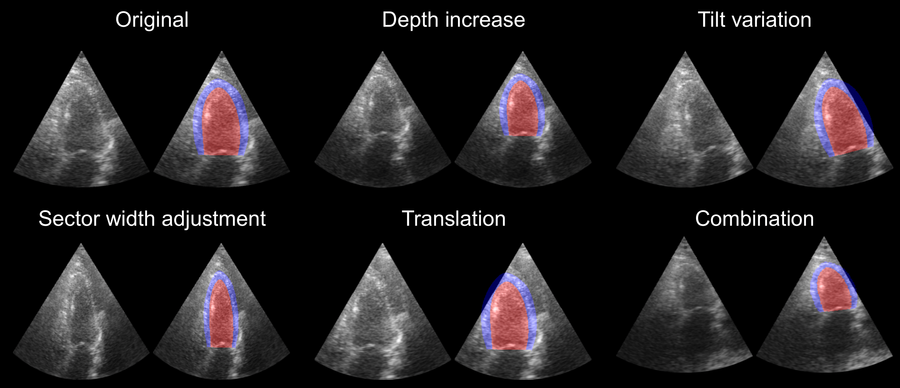
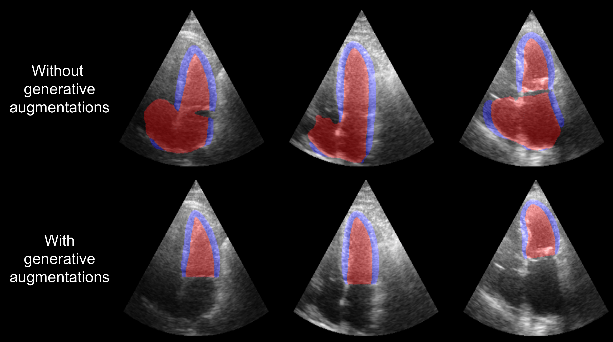

# Echo Generative Augmentation using INpainting Synthesis (EchoGAINS) 💪




## Publication & Citation

Academic publication to be announced.

Blog post: [https://gillesvandevyver.com/#/projects/generative-ai](https://gillesvandevyver.com/#/projects/generative-ai)


## Toturial
A Jupyter notebook toturial is available at

[tutorial/tutorial.ipynb](tutorial/tutorial.ipynb).


## Installation
The package can be installed using pip from github:
```bash
pip install git+https://github.com/GillesVanDeVyver/EchoGAINS.git
```
Alternatively, you can download the source code and install it using pip:
```bash
pip install .
```

## Main features
EchoGAINS creates many variations of a labelled image without affecting annotation quality
An image and it's label are transformed and the missing parts are inpainted to create a
realistic sector again.


A segmentation model trained on the augmented dataset is significantly more robust.




## License and Attribution
This project is an adaptation of the RePaint project, which itself is an adaptation from the Guided Diffusion project: 

Original project: guided-diffusion by Dhariwal and Nichol (OpenAI), available at https://github.com/openai/guided-diffusion, licensed under the MIT License.
Modifications were made in the RePaint project by Lugmayr et al. (Huawei Technologies Co., Ltd.), available at https://github.com/andreas128/RePaint, licensed under CC BY-NC-SA 4.0.
This project, EchoGAINS, by Van De Vyver et al. (Norwegian University of Science and Technology), is a modification of RePaint and is licensed under CC BY-NC-SA 4.0.


## Contact

Developer: <br />
[https://gillesvandevyver.com/](https://gillesvandevyver.com/)


Management: <br />
lasse.lovstakken@ntnu.no <br />
erik.smistad@ntnu.no <br />


The package has been developed using python 3.10.